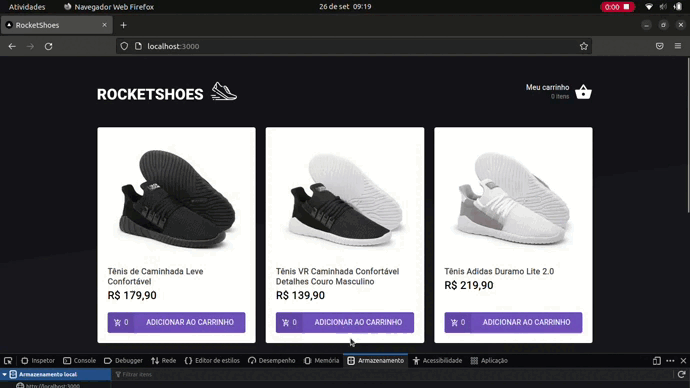

# Criando hook para carrinho de compras

    

## Sobre
Esse projeto tinha como objetivo principal criar e implementar as funcionalidades de um carrinho de compra.

Inicialmente tive acesso a 1 componente (Header), 2 páginas (Cart e Home) e o Hook useCart, dessa forma, precisei implementar a lógica do site nesses 4 arquivos para a página e o carrinho de compras funcionarem corretamente, além disso, usei Typescript, React, JSON server pra simular uma fake API e o localStorage para manter os dados armazenados no navegador   
Por último e não menos importante era necessário cumprir 17 testes (escritos pela equipe da Rocketseat) que envolviam o funcionamento desses arquivos.

## Tecnologias

- React
- Typescript
- Axios
- npm/yarn
- JSON server

## Como executar

    1 - Clone o repositório
    2 - No diretório do projeto execute: yarn ou npm i
    3 - yarn server ou npm run server (Isso irá inicializar a fakeAPI)
    4 - Em outro terminal, ainda no diretório do projeto, execute yarn start ou npm run start(Isso irá inicializar o projeto)
    5 - A partir daí, basta ir no navegador e acessar http://localhost:3000
    6 - (OPCIONAL) yarn test (Para rodar  os testes da aplicação)